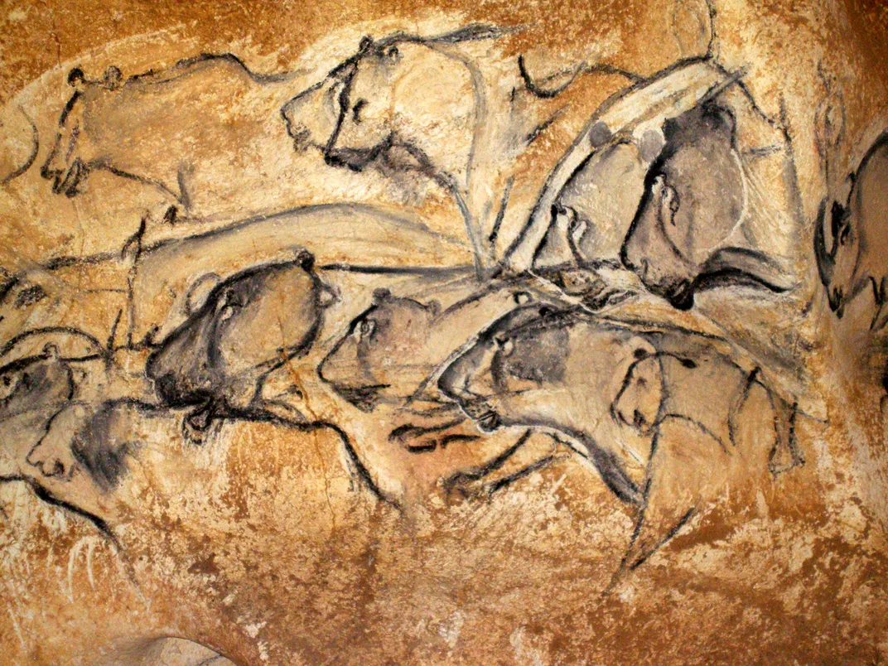

+++
title = 'The Age of Earth: Birth of Geology'
date = 2024-11-11T18:40:03+01:00
draft = false
tags = ['historical']
series = 'Rock art'
thumbnail = 'apr2015_h07_chauvetcave.webp'
+++

The story of Earth's age is a fascinating journey through time, blending mythology, scientific inquiry, and revolutionary ideas. It begins with the work of James Ussher, an Irish bishop in the 17th century, who famously calculated the Earth's creation date as **4004 BC**, using the Bible as his primary source material. At the time, mythological and religious texts were often seen as the authoritative guides to the world’s history, and Ussher's conclusion was widely accepted.

> The Creation of the Universe was said, by Ussher to have taken place on: "the entrance of the night preceding the 23rd day of October... the year before Christ 4004"
{caption="— James Ussher"}

### The Shift from Mythology to Science

As the scientific revolution gained momentum, the reliance on mythology began to wane. One of the key turning points in geology came with the work of **James Hutton**, a Scottish geologist in the late 18th century. Hutton proposed the **Theory of the Earth**, which argued that the Earth was much older than previously believed. He introduced the concept of **uniformitarianism**, the idea that the Earth's geological processes are gradual and consistent over time. According to Hutton, the present is the key to understanding the past—a notion that challenged the prevailing biblical timeline and laid the foundation for modern geology.

Would love if you can take time to watch this video:


However, not all early geologists agreed with this idea. The theory of **catastrophism**, which suggested that Earth's features were shaped by sudden, violent events (such as Noah's flood), remained popular for some time. **Charles Lyell**, an English geologist, further refined Hutton's ideas in his groundbreaking work _Principles of Geology_ (1830-1833)[^1]. Lyell argued strongly for uniformitarianism, positing that geological processes observed today, such as erosion and sedimentation, were responsible for shaping the Earth over vast periods of time.

### Charles Darwin and Evolution

In the 19th century, the work of **Charles Darwin** added another layer of understanding to the history of Earth. Darwin’s seminal book, _On the Origin of Species_ (1859)[^2], introduced the theory of evolution through natural selection. Darwin's observations on the Galápagos Islands led him to conclude that species change over time, adapting to their environments. His ideas reshaped biology and offered compelling evidence that the Earth, and the life it supports, is much older than previously thought.

Darwin's ideas were controversial, particularly in relation to human evolution. A famous quote from Darwin’s contemporary, the biologist **Francis Galton**, reads, _“The sight of a peacock’s tail, whenever I gaze at it, makes me sick!”_ This was a reaction to Darwin's concept of **sexual selection**, where traits like the peacock's extravagant tail develop because they are attractive to potential mates, even if they do not directly aid in survival.

### The Discovery of Ancient Evidence

As geological theories evolved, so did the evidence for Earth's great age. In 1878, **Don Marcelino Sanz de Sautuola** made an extraordinary discovery in **Altamira Cave** in Spain. He uncovered prehistoric paintings of bison, which suggested that early humans were capable of complex thought and artistic expression. These [rock art](/posts/south-african-rock-art) paintings were some of the earliest known examples of human creativity, illustrating the deep history of human existence. However, his discovery was initially met with skepticism—many believed that such art could not possibly be the work of primitive humans.

Similarly, in the late 19th century, European societies began to recognize evidence of early human life. The discovery of **Neanderthal fossils** in 1899 at **Hušnjakovo Brdo** in Croatia marked a significant milestone in understanding human origins. These fossils were linked to the idea of "cave men," creatures that lived long before modern humans and were seen as a crucial part of understanding humanity’s **primordial state**.

### The Development of Scientific Dating Methods

By the early 20th century, advancements in dating methods provided concrete evidence to support the idea of an ancient Earth. One significant breakthrough was the use of **uranium dating** to estimate the age of rocks and the Earth itself. This scientific technique confirmed the theories of Charles Lyell and others who had long argued that the Earth was far older than the biblical timeline suggested.

In addition to the geological discoveries, the fossil record began to show evidence of early human ancestors. The discovery of **Lucy**, an early hominid in 1974, further cemented the idea that human evolution had been ongoing for millions of years. Lucy, an **Australopithecus afarensis**, lived around 3.2 million years ago and walked upright—an essential step in the evolution of humanity.

### Conclusion

The study of Earth’s age has dramatically changed our understanding of the planet and our place within it. From the mythological explanations of Ussher to the scientific breakthroughs of Hutton, Lyell, Darwin, and others, geology has evolved into a rigorous science. The evidence for an ancient Earth is now overwhelming, and each new discovery, whether it be fossils, ancient cave paintings, or advanced dating methods, further solidifies our understanding of Earth’s deep and complex history.

[^1]: Charles Lyell's groundbreaking work, *Principles of Geology*, argued for the uniformitarianism theory, which stated that the Earth's geological processes are gradual and consistent over time, shaping the Earth's features through ongoing processes rather than cataclysmic events.
[^2]: Freeman, R. B. (2007). [_Charles Darwin: A companion_](http://darwin-online.org.uk/content/frameset?itemID=A27b&viewtype=text&pageseq=114) (2nd online ed.). [The Complete Works of Charles Darwin Online](https://en.wikipedia.org/wiki/The_Complete_Works_of_Charles_Darwin_Online "The Complete Works of Charles Darwin Online"). pp. 107, 109. [Archived](https://web.archive.org/web/20141225163344/http://darwin-online.org.uk/content/frameset?itemID=A27b&viewtype=text&pageseq=114) from the original on 25 December 2014. Retrieved 25 December 2014.

